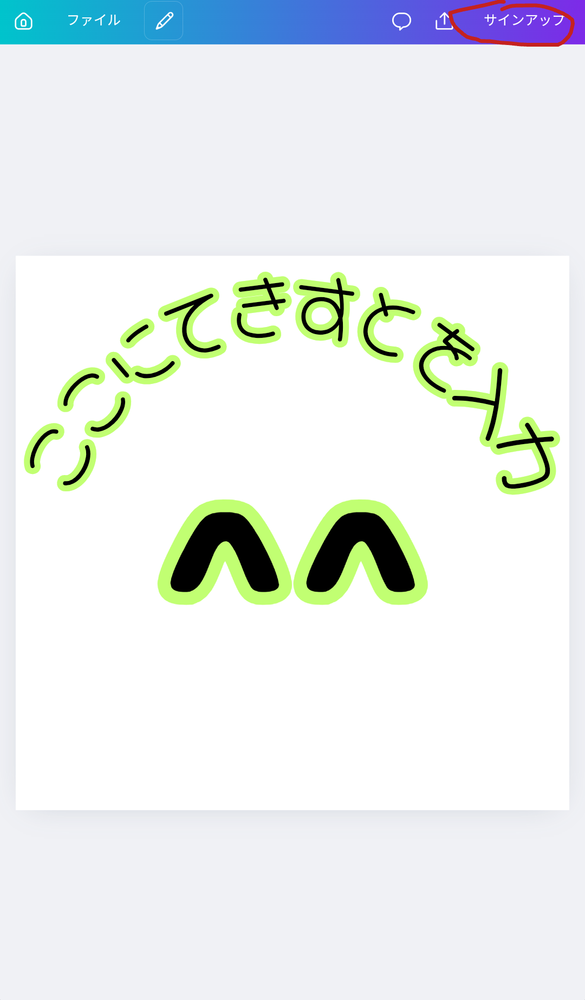
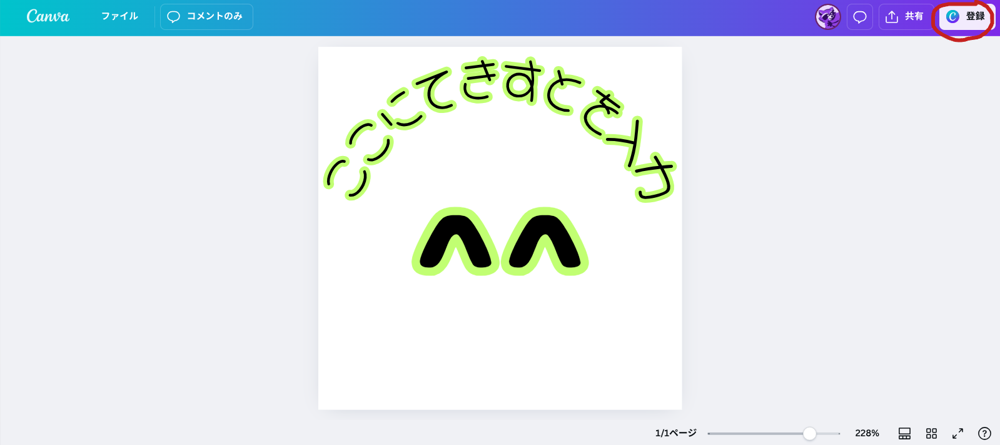
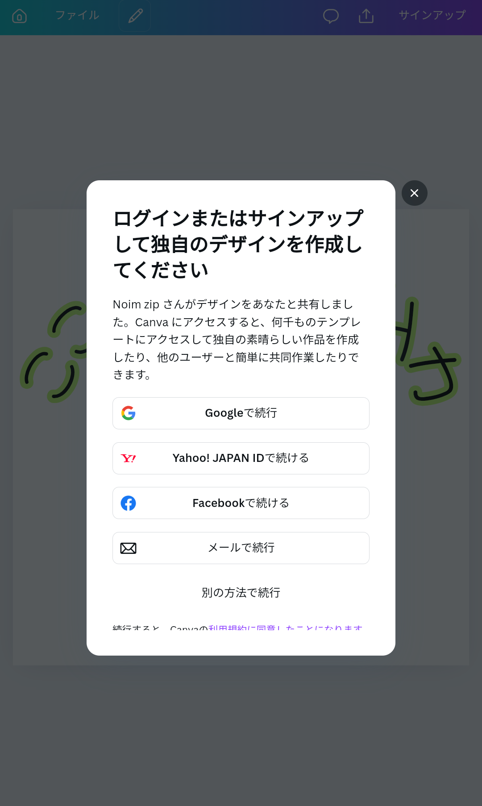
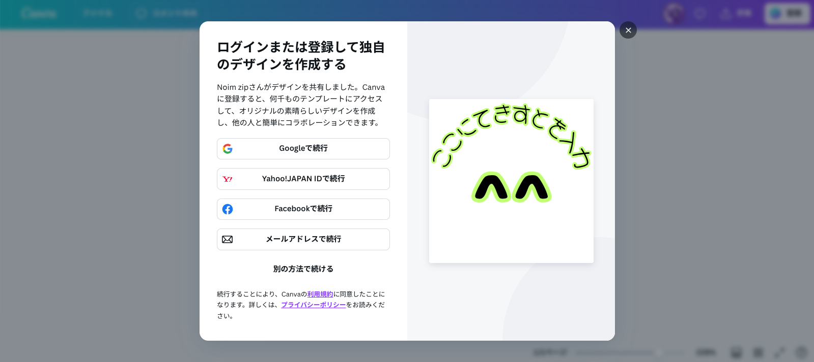
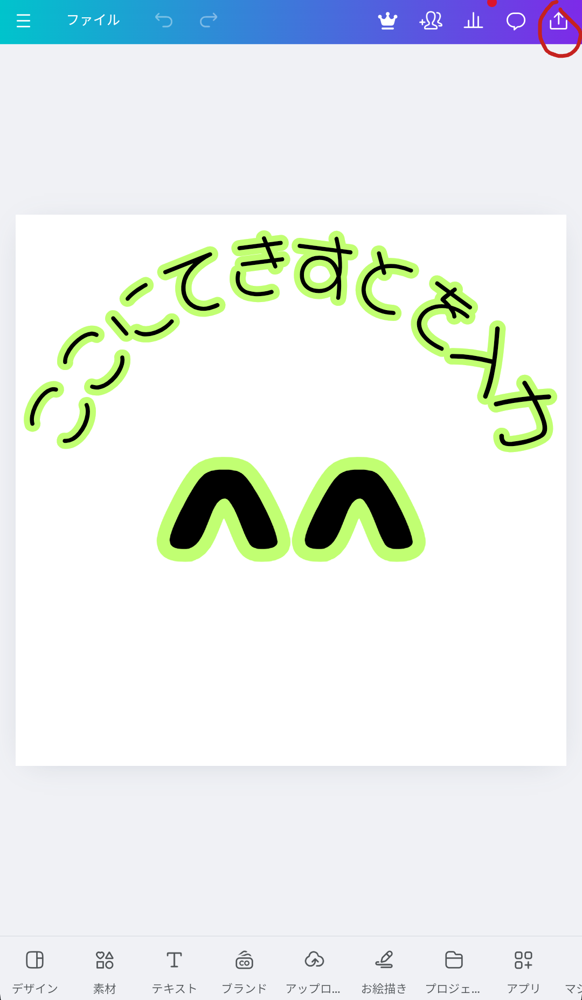
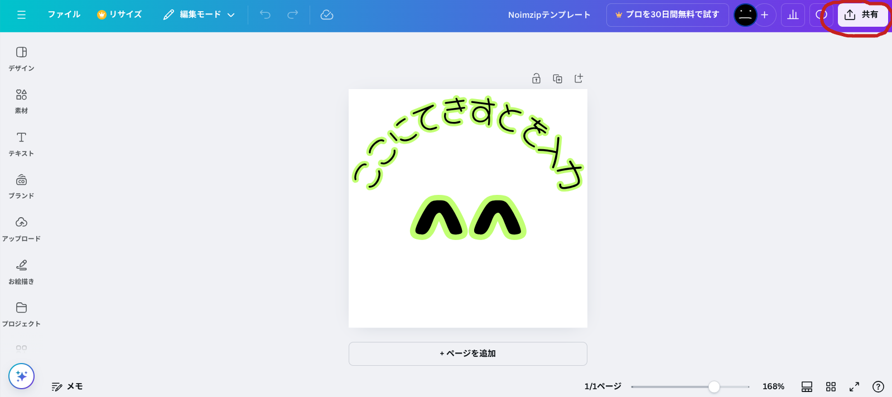
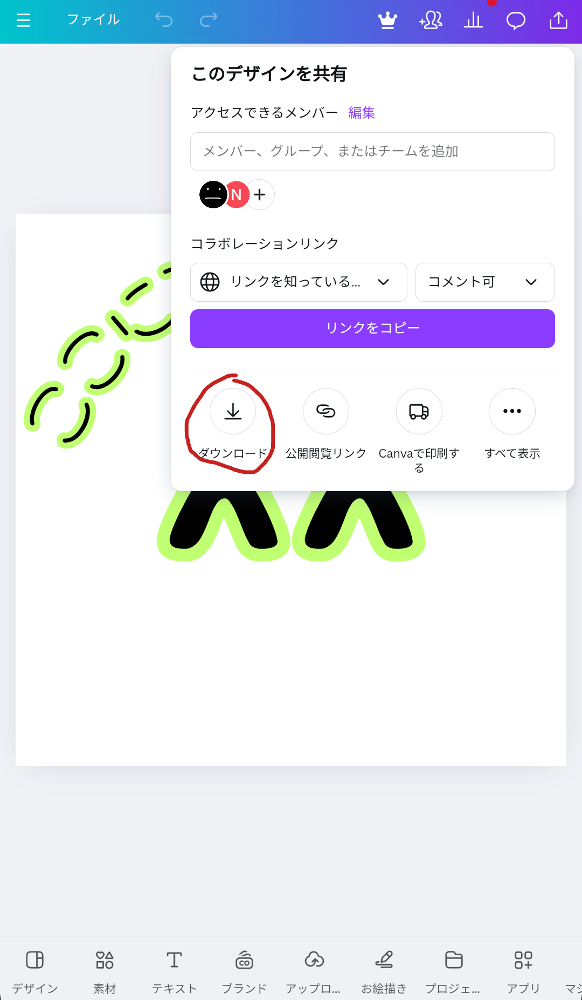
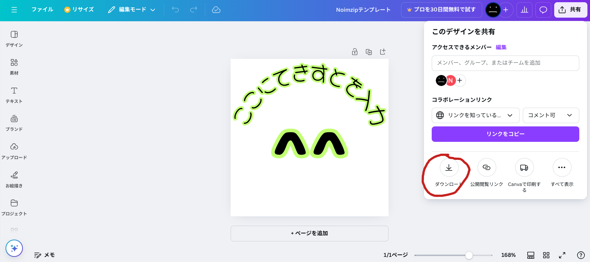
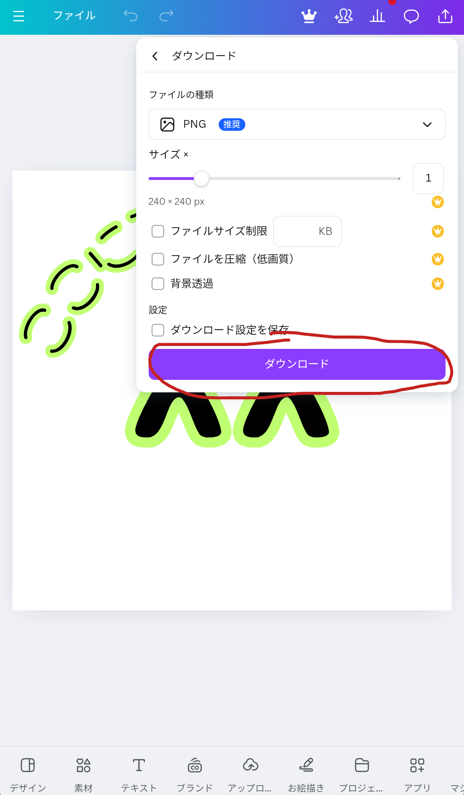
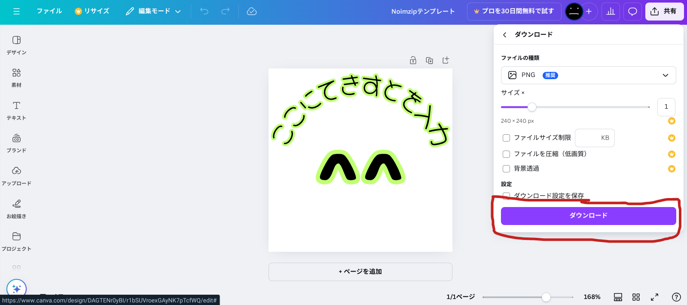

# Noimzipスタンプカスタムガイド(日本語)
## 規約
1.MIT License に基づいて利用をすること。
## 手順1.MIT Licenseの確認
個人利用の方は気にせず利用してください。
**再配布や商用、非商用利用をする方は必ず確認をしてから公開をしてください。**
## 手順2.Canvaのアクセスとアカウント作成
まず、下記のリンクにアクセスしてください。スマホの方は上の画像、パソコンの方は下の画像を参考にしてください。

https://www.canva.com/design/DAGTENr0yBI/r1bSUVroexGAyNK7pTcfWQ/edit?utm_content=DAGTENr0yBI&utm_campaign=designshare&utm_medium=link2&utm_source=sharebutton

まず、右上の登録(サインアップ)ボタンをクリックまたはタップ

次に好きな方法でアカウント登録(Googleがおすすめ)

## 手順3.ダウンロード
**カスタムに関しては省きます。検索して使い方を調べて自分なりにカスタムスタンプを作成してください！**

(一応多少の使い方に関しての説明は NextChance1118@gmail.com 宛にメールを送るか、InstergramのDMで言ってくれたらやります!^^)

右上の共有ボタンをクリックまたはタップ

ダウンロードボタンをクリックまたはタップ

この通りの設定にしてダウンロードボタンをクリックまたはタップ

## 手順4.使ってください^^!!!!
**MIT Licenseに基づいた使い方をしてほしいとは言いましたが、LINEやDMで使うのは勝手にしてください^^!!! なんなら度を超えないならSNSとかで使っちゃってください!!**

よかったらこれを友達や家族にシェアをしてほしい^^!!!!

色々作ってみんなのためになるものを作ってほしい^^!!!!!!! 収益よりも自由が一番^^!!!!!!!! 僕はみんなの感謝とか笑顔がもっと見たい^^!!!!!!!! 

ぜひシェアお願いします^^!!!!!!! ^^